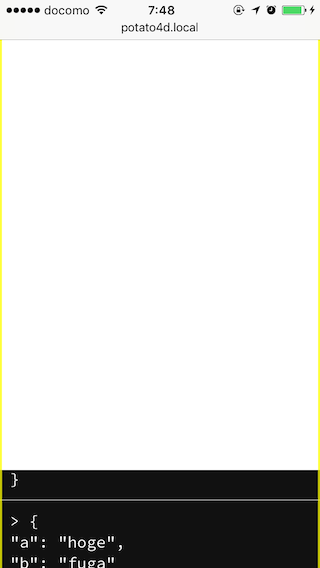

# NightVision

NightVision is Mobile Interactive Debugging System override `console.log`.



## Installation

```
$ npm install -D nightvision
```

## Usage

```
require("nightvision").init() // Ready.
```
